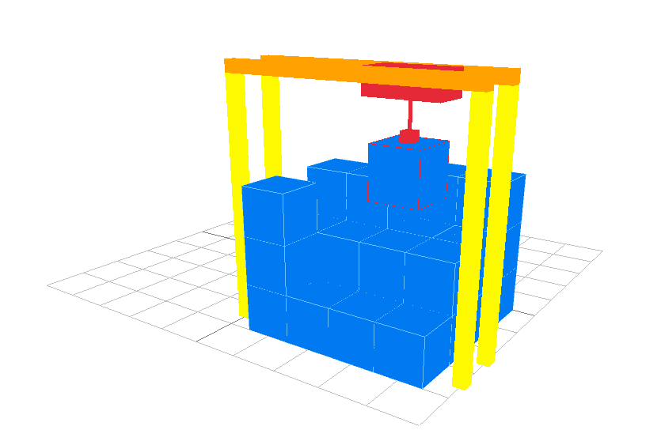

# crane_controller
### A Python warehouse crane simulator

The Crane Controller Python module can simulate the movement of a warehouse 
crane. Its meant to be used as a visual debugger for programming the movement 
of a crane. It can simulate crane movement, attachment and detachment of 
containers (cubes in the simulation) and idle idle time.

## Getting started

### Installation
If you have git on your machine you can run: \
`git clone https://github.com/BramALVos/crane_controller` \
Or you can download it here from Github using the code button and than download 
zip (which you need to unzip of course).

The module requires an installation of a wrapper for the C library 
[raylib](https://www.raylib.com/).
This can be installed using `pip`. If you have Anaconda on your system you can 
install it like this:
+ Open an Anaconda prompt from the windows taskbar / search (or open it in 
a terminal)
+ Type `conda install raylib`

If you don't have Anaconda you can run:\
`python -m pip install raylib`<br><br>
If you use Linux run (in a virtual environment):\
`python3 -m pip install raylib`


### Usage

Open `example.py` and play a bit with the code. Have a look what happens 
when you change a variable or add a couple of commands! If you get the basics
of the functionality you can start integrating it in your project!
You need to import the `crane_controller.py` file for this. If you would like to have 
access to all the classes and functions without having to type a namespace you 
can include the module as follows
```python
from crane_controller import *

def your_main_function():
    ...

if __name__ == '__main__':
    your_main_function()
```
See the next chapter for more details on how to use the module

## How to use crane_controller

The most important structure in this module is a CraneController.
This object should be wrapped in a with statement so all threads are stopped 
correctly when needed. CraneController needs to know the size of the virtual 
warehouse which should be passed in the constructor.
See the code below:
```python
warehouse_size = Size(4, 3, 4)
with CraneController(warehouse_size) as crane:
    ...
    # methods from CraneController can be accessed here
```

The CraneController will spawn a render thread in the background after it is 
initialized which will closed at the end of the with statement.
The CraneController needs a set of instructions in order to move the crane.
A list of instructions can be made using the CranePath object. You can append
crane commands to this object using command chaining. Valid commands are:
+ `move_to(position)` make the crane move to a specified position
+ `idle(duration)` let the crane wait for a duration in ms
+ `attach()` attach a container at the current position of the crane hook
+ `detach()` detach a container at the current position of the crane hook
The commands can be chained like this

```python
warehouse_size = Size(4, 3, 4)
move_speed = 1
attach_detach_speed = 1
path = CranePath(warehouse_size, move_speed, attach_detach_speed)
with CraneController(warehouse_size) as crane:
    (path.move_to(Position(0,0,0))
         .attach()
         .move_to(Position(0,3,0))
         .move_to(Position(1,3,0))
         .move_to(Position(1,0,0))
         .detach()
         .idle(1000))              # you can keep adding commands for as long
                                   # as you like
```

The warehouse can be filled using the `fill_warehouse()` function.
It accepts n arrays which specify the amount of containers in the y direction 
(the height) at a specific x, z coordinate. See the example below.

```python
warehouse_size = Size(4, 3, 4)
move_speed = 1
attach_detach_speed = 1
path = CranePath(warehouse_size, move_speed, attach_detach_speed)
with CraneController(warehouse_size) as crane:
    crane.fill_warehouse(
        [1, 1, 3, 3],  # z
        [3, 3, 2, 1],  # ^
        [2, 2, 2, 2],  # |
        [3, 1, 1, 1],  # -----> x
    )

    (path.move_to(Position(0,0,0))
         .attach()
         .move_to(Position(0,3,0))
         .move_to(Position(1,3,0))
         .move_to(Position(1,0,0))
         .detach()
         .idle(1000))
```

The `CraneController.exec()` function can be called after this setup with the 
CranePath.

```python
warehouse_size = Size(4, 3, 4)
move_speed = 1
attach_detach_speed = 1
path = CranePath(warehouse_size, move_speed, attach_detach_speed)
with CraneController(warehouse_size) as crane:
    crane.fill_warehouse(
        [1, 1, 3, 3],  # z
        [3, 3, 2, 1],  # ^
        [2, 2, 2, 2],  # |
        [3, 1, 1, 1],  # -----> x
    )

    (path.move_to(Position(0,0,0))
         .attach()
         .move_to(Position(0,3,0))
         .move_to(Position(1,3,0))
         .move_to(Position(1,0,0))
         .detach()
         .idle(1000))

    crane.exec(path) # start executing the commands from path in order
```

## Getting help

You can start an issue on Github or if you are one of the HZ students you 
can ask Bram for help.

## Issues and contributing

This module has some weird design decisions in retrospect which makes it prone 
to bugs. The design of this module may be changed in the future but there is no
guaranty.

You can support the project by contributing if you wish. 
If you like to refactor al the code to make it better (not that hard because 
the code is bad), you are more than welcome! :)


## Screenshots

